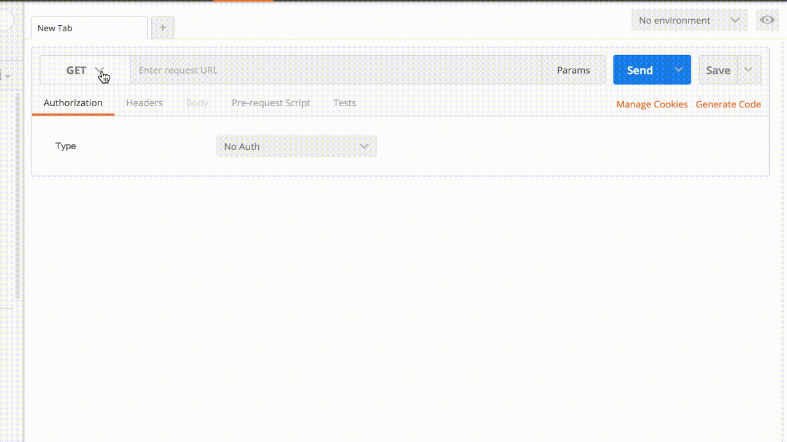

# TFServe

TFServe is a framework designed to serve tensorflow models in a simple and easy way as an HTTP API server. It's built on top of [apistar](https://github.com/encode/apistar).

## How to install

```bash
$ pip install git+https://github.com/iitzco/tfserve.git
```

> Soon to be available on `PyPI`.

## How to use

You will need 5 parts:

1. **Model**: it can be a `.pb` file, a `.ckpt` path or a model directory.
2. **Input tensor names**: name of the input tensors of the graph.
3. **Output tensor names**: name of the output tensors of the graph.
4. **`encode`**: python function that receives the request body data and outputs a `dict` mapping input tensor names to input values.
5. **`decode`**: python function that receives a `dict` mapping output tensor names to output values and returns the HTTP response.

Follow the example to learn how to combine these parts...

### Example

Deploy image classification service that receives a binary jpg image and returns the class of the object found in the image alongside it's probability.

```python

# 1. Model: trained mobilenet on ImageNet that can be downloaded from
#           https://storage.googleapis.com/mobilenet_v2/checkpoints/mobilenet_v2_1.4_224.tgz
MODEL_PATH = "mobilenet_v2_1.4_224/mobilenet_v2_1.4_224_frozen.pb"

# 2. Input tensor names:
INPUT_TENSORS = ["import/input:0"]

# 3. Output tensor names:
OUTPUT_TENSORS = ["import/MobilenetV2/Predictions/Softmax:0"]

# 4. encode function: Receives raw jpg image as request data. Returns dict
#                     with import/input:0 value.
def encode(request_data):
    with tempfile.NamedTemporaryFile(mode="wb", suffix=".jpg") as f:
        f.write(request_data)
        # Model receives 224x224 normalized RGB image.
        img = Image.open(f.name).resize((224, 224)) 
        img = np.asarray(img) / 255.

    return {INPUT_TENSORS[0]: img}

# 5. decode function: Receives import/MobilenetV2/Predictions/Softmax:0 value
#                     and builds dict with for json response.
def decode(outputs):
    p = outputs[OUTPUT_TENSORS[0]] # 1001 vector with probabilities for each class.
    index = np.argmax(p)
    # Label_map found in https://gist.github.com/yrevar/942d3a0ac09ec9e5eb3a
    return {"class": LABEL_MAP[index-1], "prob": float(p[index])}
```

That's it! Now create TFServeApp object and run it!

```python
app = TFServeApp(MODEL_PATH, INPUT_TENSORS, OUTPUT_TENSORS, encode, decode)
app.run('127.0.0.1', 5000, debug=True) # Pass the same arguments as `apistar` run method.
```

See `client.py` for full example.

## How to consume server



> The server supports only `POST` method to `/` with the input information as part of the request body.

The input will be proccessed in the `encode` function to produce the `feed_dict` object that will be passed to the graph.
The graph output will be processed in the `decode` function and the server will return whatever the `decode` function returns.

## Help

* **What if I don't know the tensor names?**

> You can use `tfserve.helper.estimate_io_tensors(model_path)` function to get a list of possible input/output tensor names.


## Limitation

> It only works with one-to-one models. That is, models that need to run the graph only once to get the inference.
> Other architectures of inference will be supported soon. Help is appreciated!
